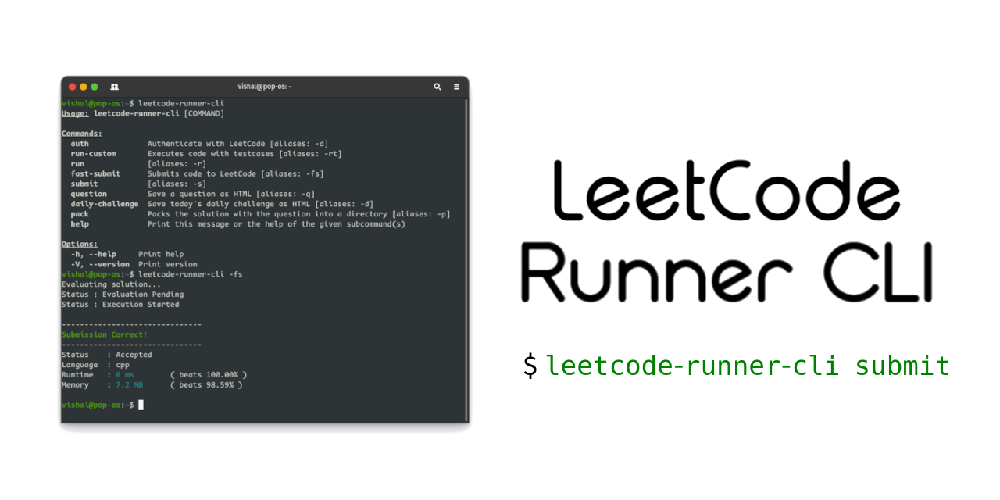

# leetcode-runner-cli

Executes leetcode testcases and submits your solution through CLI interface


[](./LICENSE)
[](./issues)



**Disclaimer :** This is not an official Leetcode tool. I am not affiliated with Leetcode in any way. This tool is not endorsed by leetcode.

---

## Installation

### Using Cargo

1. If you have [Cargo installed](https://doc.rust-lang.org/cargo/getting-started/installation.html) on your system then you can install the tool using the following command.

    ```bash
    cargo install leetcode-runner-cli
    ```

### Using pre-built binaries

1. Go to the [Releases section](/releases) and download the appropriate binary for your system.

1. Place the binary in appropriate location and add the location in your PATH environment variable.

### Building from source

1. Install [rust from here](https://www.rust-lang.org/tools/install) to compile the source code.

1. Clone the repository and move to the repository directory.

    ```bash
    git clone https://github.com/dvishal485/leetcode-runner-cli.git
    cd leetcode-runner-cli
    ```

1. Compile and install the binary.

    ```bash
    cargo install --path .
    ```

#### Platform Specific Instructions

Depending on your platform you may need to install certain tools to be able to compile successfully.

- On Ubuntu system, you may need to execute `apt-get install pkg-config openssl-dev -y` to be able to compile the program successfully.
- Windows user are good to go.

---

## Usage

1. Setup environment variable `LC_COOKIE` with your leetcode session cookie. You may search on internet to know how to setup an environment variable on your system.

   You can get your session cookie by logging in to leetcode and inspecting the cookie from Request headers in your browser's developer tools.

   Make sure to put your cookie in double quotes.

   ```bash
    export LC_COOKIE="csrftoken=abcdefgh;LEETCODE_SESSION=ijklmnopqrstuvwxyz;"
    ```

2. Execute the tool and verify your authentication.

    ```bash
    leetcode-runner-cli -a
    ```

---

```bash
leetcode-runner-cli [COMMAND] [OPTIONS <option>]
```

### Commands

| Commands           | Description                                    | Arguments                    |
| :----------------- | :--------------------------------------------- | :--------------------------- |
| `-h, --help`       | Prints help information                        | -                            |
| `-V, --version`    | Prints version information                     | -                            |
| `-a, auth`         | Authenticate with leetcode                     | -                            |
| `-d, daily`        | Fetch daily challenge question                 | -                            |
| `-q, question`     | Question title / url to fetch                  | [QUESTION_NAME] (required)   |
| `-r, run`          | Execute file with default/specified testcases  | -f [FILE] -t [TESTCASE_FILE] |
| `-s, submit`       | Submit solution after passing testcases        | -f [FILE]                    |
| `-fs, fast-submit` | Submit solution without checking for testcase  | -f [FILE]                    |
| `-p, pack`         | Pack your solution and question in a directory | -f [FILE]                    |

You can always look into a commands usage by passing `--help`.

### File changes

If you fetch the question from the CLI (using `-d` or `-q`), then tool will automatically add the required changes in the boiler plate code.

But if you are using your own code, then you need to make the following changes :

The file you submit to leetcode shouldn't have driver code like main function or struct definition. But no need to manually remove it. The tool will automatically remove the driver code and submit the solution to leetcode. All you need to do is put the delimiters `#LCSTART` and `#LCEND` in your solution file in comments, and *place leetcode problem link anywhere* in the file.

For example :

```rust
struct Solution;

// #LCSTART

impl Solution {
    pub fn two_sum(nums: Vec<i32>, target: i32) -> Vec<i32> {
        // real magic here
    }
} // #LCEND https://leetcode.com/problems/two-sum/ 

fn main() {
 // can have anything which may assist you
}
```

- In case link is not found, the tool will exit with error message for the same.
- In case start delimiter is not found, the tool will run till the end delimiter.
- In case end delimiter is not found, the tool will run till the end of file.
- In case both start and end delimiters are not found, the tool will default to the whole file.

### Example usage

The file name need not to be specified explicitly with `--file` or `-f` as it is an optional field. [Check out Note below for more information](#note)

- Fetch question [koko-eating-bananas](https://leetcode.com/problems/koko-eating-bananas/)

    ```bash
    leetcode-runner-cli -q koko-eating-bananas
    ```

    *OR*

    ```bash
    leetcode-runner-cli -q https://leetcode.com/problems/koko-eating-bananas/
    ```

- Run src/main.rs with default testcases for question [koko-eating-bananas](https://leetcode.com/problems/koko-eating-bananas/)

    ```bash
    leetcode-runner-cli -r --file /src/main.rs
    ```

- Run src/main.rs with custom testcase file

    ```bash
    leetcode-runner-cli -r -t testcase.txt --file /src/main.rs
    ```

- Submit src/main.rs to leetcode

    ```bash
    leetcode-runner-cli -s --file /src/main.rs
    ```

    Note : This will first execute the default testcases (or the specified testcases if given) and then submit the solution to leetcode only if the testcases pass as a preventive measure to avoid submitting wrong solution.

- Submit src/main.rs to leetcode without running testcases

    ```bash
    leetcode-runner-cli -fs -f /src/main.rs
    ```

- Pack your code and question into a directory to maintain your progress or upload on Git

    ```bash
    leetcode-runner-cli -p --file /src/main.rs
    ```

#### Note

1. [Code file should have the link of question in the comments](#file-changes) for the following examples.
2. If you don't specify file location then the tool will search for code in the current directory and use it by default.
3. If there are multiple files, then the tool will use file named `main` or the first file it finds in case there is no `main` file.

So, in the above examples, you can simply do `cd ./src` and then run the following commands :

- Execute with custom testcases : `leetcode-runner-cli -r -t testcase.txt`
- Execute with default testcases : `leetcode-runner-cli -r`
- Submit : `leetcode-runner-cli -s`
- Submit without running testcases : `leetcode-runner-cli -fs`
- Pack code : `leetcode-runner-cli -p`
  
---

## Languages supported

This is a generic module that can be used to run any language. It only needs a mapping to the `language` on leetcode and `extension` of the file.

Currently, the following languages are added by default :
Rust, Python3, Cpp, Java, C, Javascript, Go, Kotlin, Swift, Typescript, Csharp, Ruby, Scala, PHP, Racket, Erlang, Elixir, Dart.

More languages can be added manually as per requirement by [changing enum](https://github.com/dvishal485/leetcode-runner-cli/blob/main/src/file_parser/language.rs) in the `src/file_parser/language.rs` file.

---

## License & Copyright

- This Project is [Apache-2.0](./LICENSE) Licensed
- Copyright 2023 [Vishal Das](https://github.com/dvishal485)

---
